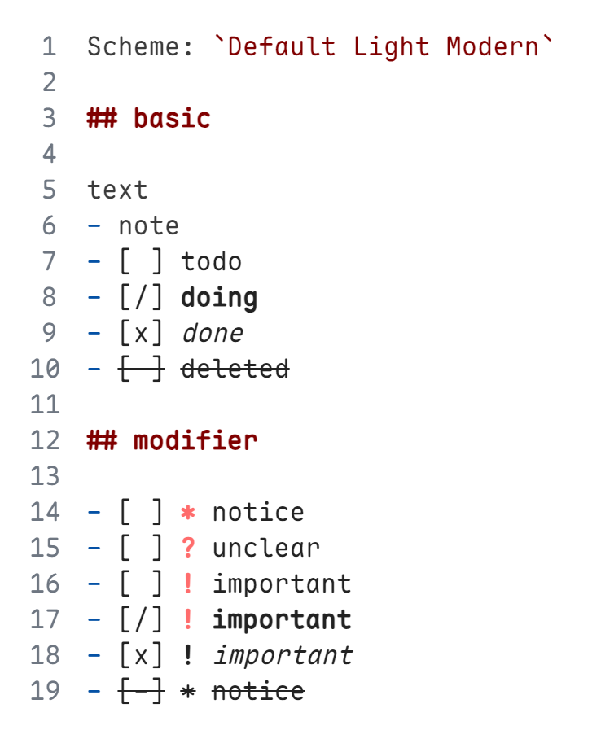

    

# Bullet Journal Markdown - Lite

A lite version of [**BuJo**](https://bujo.mihaiconstantin.com)[^BuJo].

[^BuJo]: a [VS Code](https://code.visualstudio.com/) extension that adds syntax highlighting for Bullet Journal entries and provides convenient commands, snippets, keybindings, and more for managing tasks and notes in Markdown.

## Features

### Syntax Highlighting

Provides highlighting for the standard Bullet Journal entries.

    
    

### Task Management

Proposes commands and keybindings to effortlessly update task statuses.

| Name                            | Description              |
| ------------------------------- | ------------------------ |
| `bujo-lite.symbol.setCompleted` | BuJo-Lite: Set Completed |
| `bujo-lite.symbol.setOpened`    | BuJo-Lite: Set Open      |
| `bujo-lite.symbol.setStarted`   | BuJo-Lite: Set Started   |
| `bujo-lite.symbol.setDropped`   | BuJo-Lite: Set Dropped   |

## Release Notes

See the [CHANGELOG](CHANGELOG.md) file.

## License

`BuJo-Lite` is licensed under the [MIT license](LICENSE).
